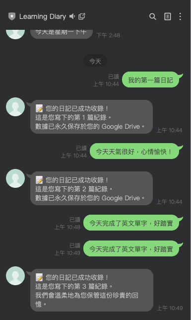
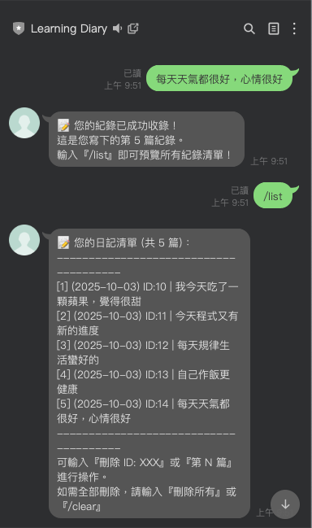
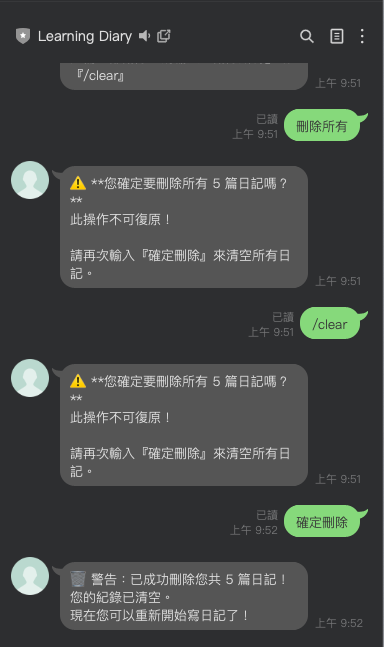
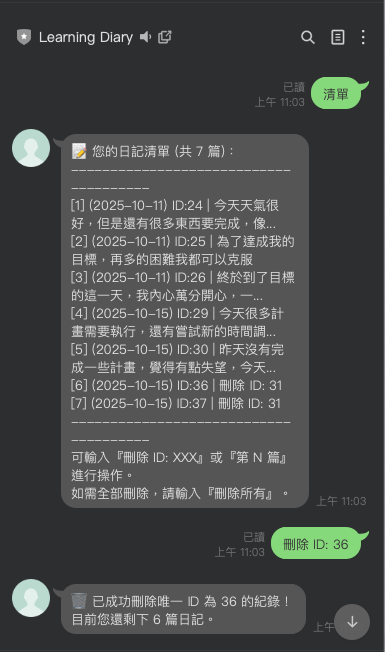
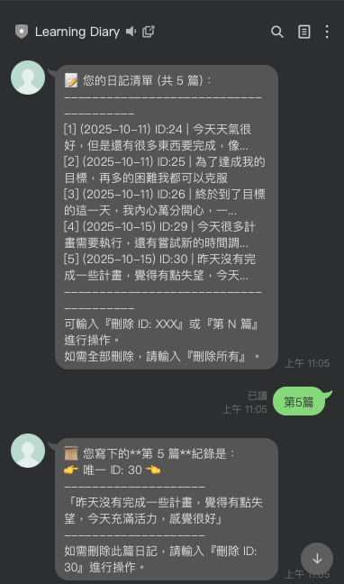

# 📌 專案簡介

這是一個基於 LINE Messaging API 與 Flask 的聊天機器人專案。 目前為 v1：新增 SQLite 紀錄的功能，主要將使用者輸入的內容，儲存至SQLite中，以供後面【每週回顧】及【AI回覆】使用。 

## ⚙️ 安裝方式
- 首先先在SQLite中建立搜集資料欄位，本專案使用colab撰寫程式，設立新的檔案為v1_sqlite_dataseat.py（一定要存成py檔）
- 接著將v1_sqlite_dataseat和v0_EchoDemo的程式碼合併，更換掉「回聲測試」的部分
- 在合併的檔案前面加上「掛載 Google Drive 」以及「加入專案路徑」，確保v1_sqlite_dataseat是可以被找到並且讀取
- 接著「安裝套件」後，重新產生新的ngrok網址，將網址貼到 Line Developers專案中
- 在「LINE Bot 程式」中輸入【Channel access token】、【Channel secret】後，執行程式
- 將Webhook URL打開，即可在Line輸入訊息，以及查詢訊息
- 輸入「/list」可以查看完整訊息內容
- 輸入『刪除 ID: XXX』或『第 N 篇』進行操作
- 輸入「刪除所有」或「/clear」可刪除全部日記

## 📊 成果展示

## 🚀下載專案
git clone https://github.com/YANGYUNTZU/LineBot-learning-diary-bot.git  
cd LineBot-learning-diary-bot/src/v1 SQLite 紀錄

## 📅 後續計畫
- v2：關鍵字提取模組（TF-IDF）
- v3：每週回顧（統計 + 簡單分析回饋）
- v4：AI回覆
