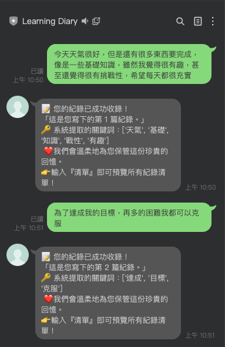

# 📌 專案簡介
這是一個基於 LINE Messaging API 與 Flask 的聊天機器人專案。
目前為 v2 關鍵字提取功能，功能為在使用者的日記內容提取重要關鍵字，為AI模型提供參考。
此專案將會逐步演進，最終目標是打造一個能夠 紀錄學習日誌、分析關鍵字與情緒、並提供週報與回饋 的「學習日誌情緒教練 Bot」。

## ⚙️ 安裝方式
- 創建keyword_extractor的程式碼，使用 Jieba 內建的 TF-IDF 算法提取中文關鍵詞。
- 修改v1主要程式碼，加入提取關鍵字功能
- 製作停用字清單，讓TF-IDF過濾掉無用的詞彙
- keyword_extractor,py中加入停用字清單
- 重新啟動程式碼，測試

## 📊 成果展示
  

### 🚀下載專案
git clone https://github.com/YANGYUNTZU/LineBot-learning-diary-bot.git  
cd LineBot-learning-diary-bot/src/v2關鍵字提取

## 📅 後續計畫
- v3：每週回顧（統計 + 簡單分析回饋）
- v4：AI回覆
